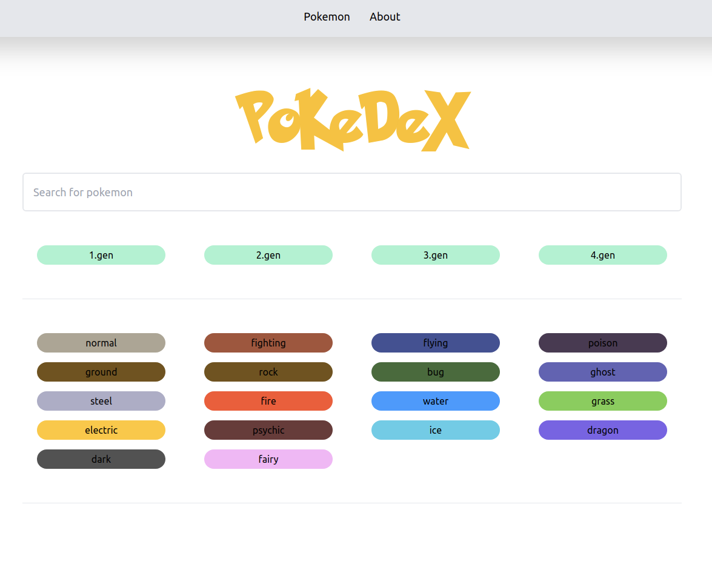
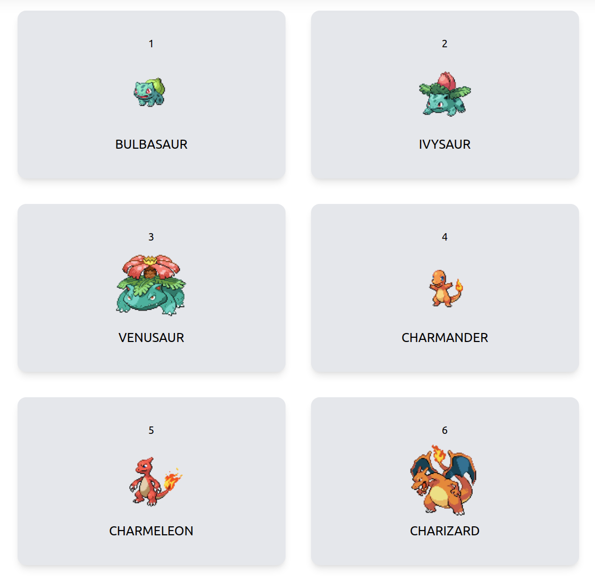

# Pokedex


## Landingpage





## How to run


<p>First off, the images won't be displayed if not downloaded.<br>
You could use the .php script provided in the root of the project.<br>
If that does not suit you, then download them otherwise through the 
URL in the script</p><br><br>
Then run to quickly serve the app:

```
npm run dev
```


